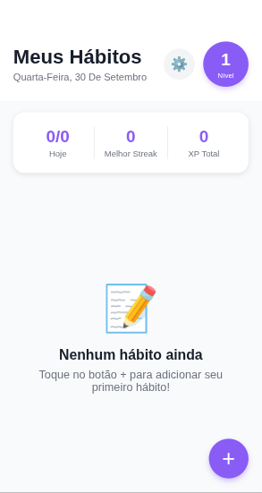
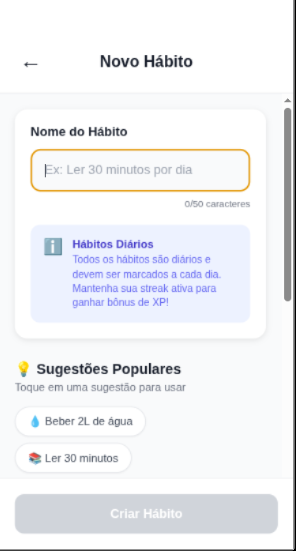
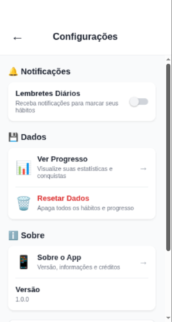

# 🎯 Habit Tracker (Diário de Hábitos)

> ⚠️ **Nota:** Este repositório é um **re-upload** de um projeto desenvolvido anteriormente, publicado nesta conta para fins de organização, preservação do histórico de código e atualização de portfólio.

Um aplicativo mobile intuitivo e gamificado para gerenciamento e acompanhamento de hábitos diários, desenvolvido com **React Native** e **Expo**. O projeto ajuda os usuários a construírem rotinas consistentes por meio de recompensas com pontos de experiência (XP), sequências (*streaks*) e progressão de níveis.

---

## 🚀 Funcionalidades

- 📌 **Gerenciamento de Hábitos:** Criação, acompanhamento e marcação de conclusão de tarefas diárias.
- 🎮 **Sistema de Gamificação:**
  - Ganho de **XP** a cada hábito concluído.
  - Bônus de XP para **streaks** (sequências de dias consecutivos).
  - Sistema de **níveis** e evolução conforme o acúmulo de experiência.
- ⚙️ **Tela de Configurações:** Painel explicativo com as regras de pontuação e preferências do app.
- 💾 **Persistência Local:** Armazenamento de dados no próprio dispositivo para manter o progresso do usuário salvo.

---

## 🛠️ Tecnologias Utilizadas

- **Framework Principal:** [React Native](https://reactnative.dev/)
- **Plataforma de Desenvolvimento:** [Expo](https://expo.dev/)
- **Linguagem:** JavaScript (ES6+)
- **Interface:** React Native Components e `StyleSheet`

---

## 📱 Interface

O aplicativo possui uma interface focada em simplicidade e acompanhamento visual do progresso, utilizando elementos de gamificação para tornar o gerenciamento dos hábitos mais envolvente.

<div align="center">





</div>

---

## 🎯 Objetivo

O projeto foi desenvolvido com o objetivo de explorar o desenvolvimento de aplicações mobile utilizando **React Native e Expo**, colocando em prática conceitos de componentes, gerenciamento de estado, persistência local e construção de interfaces para dispositivos móveis.

A proposta também foi experimentar como elementos de gamificação podem ser utilizados para incentivar a consistência na construção de hábitos.

---

## 💻 Como Rodar o Projeto Localmente

### Pré-requisitos

- **Node.js** instalado
- Gerenciador de pacotes (**npm** ou **yarn**)
- Aplicativo **Expo Go** no celular ou um emulador Android/iOS configurado

### Passo a Passo

1. **Clone o repositório:**

   ```bash
   git clone https://github.com/Weslley-141/Diario-de-habitos.git
   cd Diario-de-habitos
   ```

2. **Instale as dependências:**

   ```bash
   npm install
   ```

3. **Inicie o servidor de desenvolvimento:**

   ```bash
   npm run start
   ```

4. **Execute no seu dispositivo:**
   - Abra o aplicativo **Expo Go** no celular e escaneie o código QR gerado no terminal.

---

## 👨‍💻 Autor

**Weslley Eugênio**

GitHub: [@Weslley-141](https://github.com/Weslley-141)
